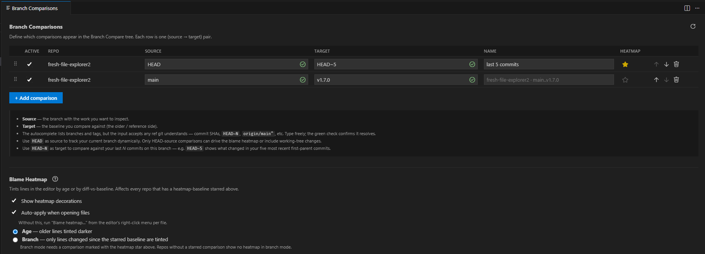
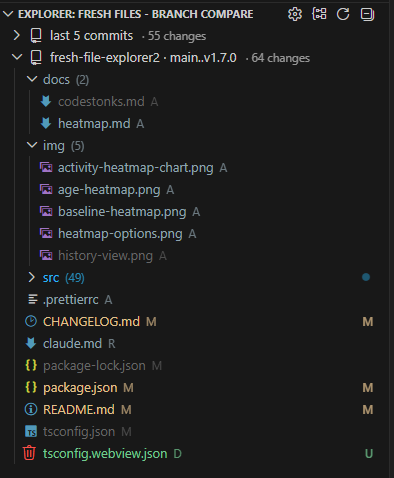
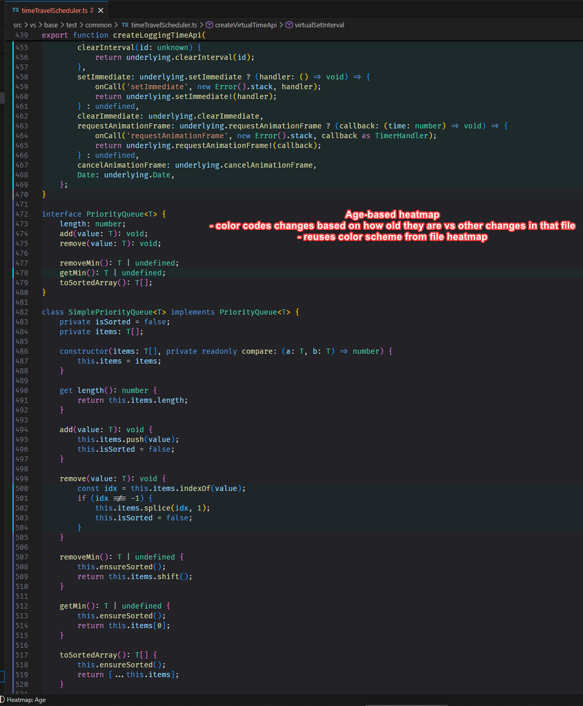
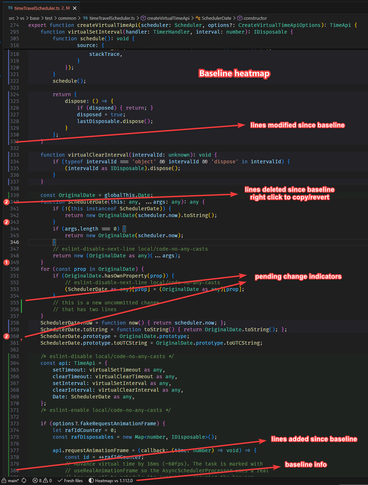
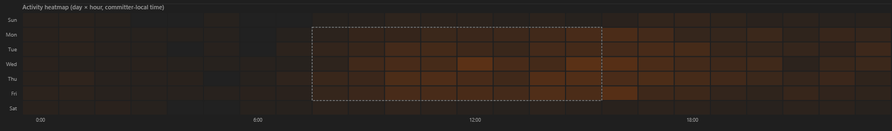
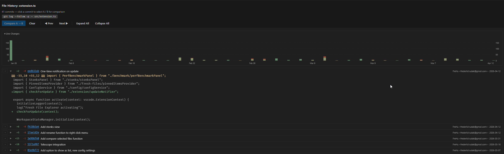
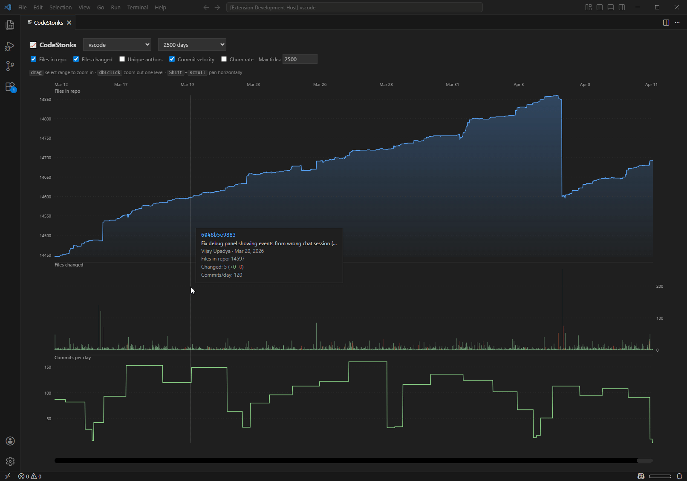

# Change Log

## [1.13.0]

### Fresh Files

- Grouped views (Author/Commit/etc) now correctly nest **under each repository** instead of merging groups across all repos
- Uncommitted work now shows in a **Pending** group in every grouped view (previously dropped outside the file-structure view), pinned to the top.
- **Open Commit** is now available directly on commit-group headers, not just on individual files.
- **Open Changes** on the Pending group opens all uncommitted changes (HEAD ↔ working tree) as a single multi-diff.
- Auto-expand depth now counts the repository level in grouped views (depth 1 expands repos, depth 2 expands the groups inside them).
- **Open Settings** action in the `…` overflow menu — jumps straight to this extension's settings.

### Branch Compare

- **Open Commit** action on commit-group headers (Commit Hash grouping).
- **Open Changes** action on the Pending group — a multi-diff of uncommitted changes (HEAD ↔ working tree), alongside the existing "focus source control" action.
- The Pending group is now pinned to the top instead of the bottom (consistent with Fresh Files)
- File rows now follow the **Sort Order** setting (consistent with Fresh Files).

### General
- Detect repo added/removed automatically - no longer requires a manual refresh
- AI co-authorship is surfaced with a clanker icon 🤖 on the commit label. The detection is e-mail based, and common ones are built in. Custom clankers can be specified in settings: `freshFileExplorer.aiCoAuthorEmails`
- Miscellaneous improvements to tree labels

### Fixes

- Performance: opening a workspace with several repositories and/or a wide time window is now fast again
- Nested git worktrees (a worktree created inside another repo's working tree) no longer appear as phantom files or changes in Fresh Files or Branch Compare. The tested and recommended worktree setup with this extension is sibling-level folder per worktree.
- A broken worktree setup (resulting from folders moved on disk) could cause a massive hang in the repo discovery phase. This is now detected and you will get a warning notification with instructions on how to fix it.

## [1.12.0]

### Respect `files.exclude`

- The tree now hides files matching each workspace folder's `files.exclude` setting, mirroring the VS Code Explorer. **On by default**. Turn it off with `freshFileExplorer.respectFilesExclude`.
- Matching mirrors VS Code's own glob engine (`*`, `?`, `**`, `{a,b}`, `[a-z]`). Sibling (`when`-clause) excludes are not yet supported.

### Respect `.mailmap`

### Time windows
- Time windows everywhere now accept duration tokens including sub-day (e.g. `6h, 2w, 1mo`). The defaults have been refined (your set windows are untouched by this).

### Diff Search (pickaxe)

- **Include merge commits** toggle
- String search now uses `-G` so same-line edits surface (previously `-S`, which only counts occurrence changes).
- Git regex errors are surfaced in the panel instead of being swallowed as "No matches".
- Results-side **added/removed filter** to narrow the result set.
- **Copy actions** on result items.
- **Expand All** on repo and commit nodes.
- Hardening against git config and UI noise.

### Branch compare

- A "focus source control" action was added to the pending changes group (visible in commit/author/moon phase grouping modes)

## [1.11.0]
- Branch Compare now has its own left-click toggle (Open Changes / Open File), independent of Fresh Files and defaulting to diffs. The left-click toggle buttons now alternate their icons (file ↔ diff) to reflect the current mode.
- "Open All Changes" (Branch Compare) now opens a single multi-diff editor instead of one tab per file 
- Fix: "Open All Found Files" (Diff Search) opened only the last file (a recycled preview tab); all files now open as quiet background tabs
- Branch Compare: per-comparison **diff mode** — *merge* (diff vs the merge-base, PR-style) or *full* (exact diff against the target ref), chosen per comparison in the settings panel.
- Branch Compare: grouping mode can now be set per-comparison from the comparisons settings panel

## [1.10.2]

- Right click option to reveal file in OS file manager (matches the built-in Explorer)
- Configurable update-notification threshold via `freshFileExplorer.notifyOn` — notify on `patch`, `minor` (default), or `major` updates only
- Output log is now a filterable log channel
- Fix: uninitialized submodules no longer mess with the loading process, now grouped under a separate tree node
- Internal: package.json validation and lint hardening

## [1.10.1]

- Branch Compare: swap source/target sides from the settings panel
- Status bar: can now be toggled off via config
- Fix: status bar loading state could get stuck when the Fresh Files view was never revealed
- Fix: blame heatmap markers leaking into diff editors (for real this time)
- Fix: duplicate cancel button in confirm dialog
- Internal: drop custom "reveal if open" logic in favor of the built-in `workbench.editor.revealIfOpen`
- Publish process security hardening

## [1.10.0]

### Branch Compare

A new tree view that surfaces saved branch-to-branch comparisons. Each row is one `source..target` ref pair.

| Settings panel | Tree view |
|---|---|
|  |  |

#### How it works

- Open the settings panel via the gear icon in the view title.
- Add a comparison: pick a repo, type a **source** ref (the branch with the work) and a **target** ref (the baseline you compare against).
- Click any file in the tree → opens a diff between the comparison's baseline (the merge-base) and the source ref.
- Right-click a deleted file → **Restore from Baseline** writes the baseline content back into the working tree as an unstaged change.
- Right-click a section or folder → **Open All Changes** queues every diff in the background.

#### What goes in source/target

- **Branches and tags** — `main`, `origin/release-q4`, `v1.2.0`. Autocomplete lists what's available.
- **`HEAD` as source** — tracks your current branch dynamically. Only HEAD-source comparisons include working-tree changes; uncommitted files appear with a `•` marker.
- **`HEAD~N` as target** — quick "what did I change in my last N commits" view.
- **Any git-resolvable ref** — commit SHAs, `origin/main^`, etc. The green check next to the input confirms the ref resolves.

#### Multiple comparisons

Define `vs main`, `vs release-q4`, and `vs colleague-branch` simultaneously — each gets its own section in the tree. Reorder with the up/down arrows or the drag handle in the settings panel; tree order mirrors the panel.

#### Heatmap settings also live here

Star one HEAD-source comparison per repo to mark it as the blame heatmap's baseline. The heatmap then colors lines that changed between that comparison's target and HEAD.

The same panel hosts the blame heatmap on/off toggle, the auto-apply-on-open switch, and the Age vs Branch mode selector — replacing the old `settings.json` round-trip.

#### Tips/gotchas

- **Empty diff** — if source is an ancestor of target, the diff is empty.
- **Merge commits** — when a `HEAD~N..HEAD` comparison sweeps in unexpected commits via merges, the tooltip surfaces both counts so the number of files in the tree makes sense.
- **Invalid refs** are hidden from the tree. The red X next to the input in the settings panel is the source of truth.
- **Duplicates** (same repo + source + target) are deduped in the tree and flagged with a warning in the settings panel.

## Other

- Fix: blame heatmap markers should no longer leak into diff editors
- More attempts to make the readme not a wall of text

## Notes
- More additions are to be expected in future versions regarding blame, comparisons and heatmaps. Some extensions arguably still do some things better, but I wanted to focus on doing something original rather than rip them off. The baseline comparison mode is as far as I know genuinely unique, and my branch comparison settings are quite powerful and easy to set up compared to others'.

## [1.9.0]

### Blame Heatmap

Per-line gutter coloring + faint background wash inside the editor — a line-level view of the same recency signal the existing [file heatmap](docs/heatmap.md#file-heatmap) shows in the tree. Two modes:

- **Age** — color by line change recency.

- **Baseline** — color only lines changed since a chosen baseline; added lines tinted differently from modified lines; deletions surfaced as red gutter badges with restore/copy actions.

Reuses the file heatmap's `freshFileExplorer.heatmap.age*` palette plus a new `added*` palette, all customizable via `workbench.colorCustomizations`.

Full details: [docs/heatmap.md](docs/heatmap.md).

### Diff vs branch / tag

Right-click in the editor → **Diff with Branch / Tag…** opens a regular VS Code diff between the current file and a chosen branch or tag. The first invocation prompts for a ref; subsequent ones reuse it without prompting. The chosen ref is the same one the blame heatmap's Branch / Tag mode uses, so picking it once unlocks both surfaces.

### CodeStonks: Activity Heatmap chart

New chart type — a 7×24 grid of commits by day of week × hour of day, in the committer's local timezone (so contributor timezones don't blur together). Includes:

- Author multiselect filter, plus hover-over-author chip for a transient single-author preview.
- Workday-hours overlay (Mon–Fri × configurable start/end) so off-hours work pops.
- Click a cell to copy the bucket's commit hashes to the clipboard.

See [docs/codestonks.md](docs/codestonks.md#activity-heatmap).

### Fresh Files status indicator

Status bar entry showing repo discovery / file loading progress. Click to focus the tree.

### File Explorer integration

Several Fresh Files actions now also appear in the regular VS Code File Explorer right-click menu:

- **File History**
- **Reveal in Source Control View**
- **Copy Remote URL**
- **Copy Subtree Structure** — when invoked from a folder in the regular File Explorer, walks the full subtree and respects `.gitignore`. Inside the Fresh Files tree it scopes to fresh files only.

## [1.8.0]

### CodeStonks enhancements

- **X-axis modes** — now can be switched between per-commit and bucketed per day/week/month views. metrics not available for a given mode will be greyed out
- **Author concentration** — percentage of commits by the top-N authors in a rolling window (new metric)
- **Avg commit size** — rolling average of files changed per commit (new metric)
- **Watchlist panel** - reworked repo selection, this enables comparisons and shows a bit of extra info
- **Compare repos** — overlay multiple repos' "Files in repo" lines on the same chart
- **SVG export** — save the current chart as an SVG file
- **Help button** which opens [this readme](docs/codestonks.md)

### File History chart

Added a line-changes chart to the File History panel. 

- Essentially the "files changed" chart from CodeStonks but for single file history (changed lines per commit)
- Hover for a tooltip with commit hash, message, author, date, and exact line counts
- Click a bar to jump to that commit in the timeline
- Horizontal panning with scrollbar or mouse wheel when there are more than 100 commits

## [1.7.0]

### CodeStonks

A stock-price-style chart visualizing repository evolution over time. Toggle it from the Fresh Files "..." menu or the command palette.

- 5 toggleable metrics: file count, files changed, unique authors, commit velocity, churn rate
- Drag-to-zoom with zoom stack, double-click to zoom out
- Horizontal panning with scrollbar, Shift+scroll, or trackpad swipe
- Independent time window and repo selection
- Configuration persisted per workspace

## [1.6.0]

### Rename

Rename files and folders directly from the right-click menu or with `F2`.

- `freshFileExplorer.autoStageRename` (default: `true`) — uses `git mv` so the rename is auto-staged and recognized by git as a rename. When disabled, falls back to a plain filesystem rename (which shows as delete + add in git).

## [1.5.0]

### Compare selected files

Now available for fresh files and pinned items. 

Behavior:
- For 2 selected files, opens a simple comparison (like file explorer)

Unlike file explorer, you are not limited to two files
- For 3, opens a multi-diff (1-2, 1-3, 2-3). no further questions here, as the result set is still manageable
- For 3+, asks if you want to compare one vs rest or all permutations (1-2,1-3,1-4,2-3,3-4) and so on
  - If you choose one vs rest, you must also pick which is the base file

## [1.4.0]

### List view

The tree view can now be switched into a flat list. See also some new config options:

`freshFileExplorer.defaultGroupingMode`
`freshFileExplorer.defaultSortOrder`
`freshFileExplorer.flatList.labelStyle`

### Code Telescope integration

- The quick pick (CTRL+Q, F) can now be switched to open in the Code Telescope extension (guichina.code-telescope). 
- This provides a better search experience but remains fully optional (I don't make code telescope or install it for you).

You need to have the extension installed and enable `freshFileExplorer.codeTelescopeIntegration` for this to work.

## [1.3.0]
### Vastly improved performance
  
#### Percieved performance
  - Incremental loading (repo discovery, then pending, then historical changes)
  - Historical changes keep loading in the background up to your maximum configured time window.
    - You can also choose to fire an incremental update after each historical time window is ready (`freshFileExplorer.incrementalTreeLoading`). You probably don't need to enable this but it helped me make a more impressive gif of the loading process.
    - Changing time windows after the initial load no longer requires a refresh of git history, barring events like switching branches or pulling changes.
    - Changing time windows in the quick pick now does a live preview so I can show off how fast it is.
  
#### Real performance
  - Making changes in one repo will not trigger any refreshing in another.
  - Rendering a large tree is much faster.

### Right click options
- Copy + paste
- Delete
- Expand, copy structure now also available on repo level

### Submodule support

- Includes nested submodules, or the same repo appearing multiple times as submodules of different repos.
- I still consider this experimental but it's much better than the nothing in the previous version.

### Smaller things
- `[NEW]` - Reveal active file in tree. `freshFileExplorer.autoReveal` can be configured

- `[CHANGE]` - Pinned items are now a separate view. This was done so that they can properly stay at the top (or moved elsewhere). Previously they would be covered by sticky folders when scrolling down in the tree.
- `[NERFED]` - Showing added/removed lines (`freshFileExplorer.description.showLineChanges`) now only applies to pending changes. I didn't like the performance impact it had on the entire history.
- `[FIX]` - Discarding staged files silently doing nothing
- `[IMPROVED]` - Discard now asks if you want to discard unstaged/discard all/unstage/cancel (if applicable)
- `[IMPROVED]` - Staged status of files is now shown in the tree
- `[IMPROVED]` - Recursive expand occasionally failing to expand parts of the tree

## [1.2.1]
- `[FIX]` heatmap flickering
- `[FIX]` status labels for rename/copy not having proper names
- `[FIX]` potential inconsistency in commit ordering (author vs committer date)

## [1.2.0]
- [NEW] Pathspec can be set per-repo to limit git output
- [NEW] Scoping to folders
- [NEW] Right click options to copy file paths, remote url, or folder structure (as bullet points)
- [PERF] Loading is now in phases - repo discovery, then pending, then historical changes. It should now feel a lot faster (it isn't, but the view is usable long before it has all the data).
- [PERF] Loading git log now streams output instead of accumulating a potentially giant buffer. It's not faster but will always use almost no memory.
- [FIX] Heatmap would be incorrect if file explorer was in focus on startup (because we didn't load any data yet)

## [1.1.3]

- [NEW] Performance benchmark view for measuring load times 
- [PERF] Eliminate pointless refetches of git log in response to git listener (it was most of them)
- [PERF] Minor optimizations of git log (initial load)
- [CONFIG] Change counts disabled by default (because of perf)
- [DOCS] Added notes on security
- [DEPS] Removed the only runtime dependency
- [VSIX] Removed files that don't need to be there

## [1.1.2]
- [NEW] Create files action on folder level
- [CONFIG] Support older vscode engine (cursor runs on 1.105.1)

## [1.1.1]
- `[FIX]` Repos not in immediate subfolders not discovered https://github.com/FreHu/vscode-fresh-file-explorer/issues/1

## [1.1]
- `[NEW]` History search tools (pickaxe, -L, history view)
- `[NEW]` Change counts in tree view (lines added/removed)

## [1.0.7]
- `[NEW]` Menu button for search editor - open all found files
- `[NEW]` Menu button for search editor - copy paths of found files (absolute/relative)
- `[NEW]` Create new files directly from the tree view - right-click any file to create a sibling file
- `[NEW]` Support for creating multiple files and nested folder structures (e.g., `folder/file1.ts,file2.ts`)
- `[NEW]` Sort order options - sort files by name, date (newest first), or author
- `[NEW]` Consolidated "View Options" menu to reduce toolbar clutter (grouping, sorting, and filters)
- `[IMPROVEMENT]` Pending files now use actual file modification time for accurate date sorting
- `[IMPROVEMENT]` Streamlined toolbar - moved less common actions to overflow menu
- `[REMOVED]` "Expand All" from toolbar, it was janky anyway (still available via right-click on folders)

## [1.0.6]
- `[NEW]` Search in found files
- `[REWORK]` Search include pattern length limitation - no longer truncates, now batches into multiple search editors
- `[CONFIG]` Search editor is now the default preference

## [1.0.5]
- `[NEW]` Open commit - right click a file to open its last commit in a multi-diff editor
- `[REMOVED]` Welcome view with initialize repository button (pretty useless and briefly flashed during loading before we figure out there is a repo)
- `[FIX]` Open changes of new file in git history was broken

## [1.0.4]
- `[NEW]` Grouping options
- `[NEW]` Heatmap

## [1.0.3]
- `[NEW]` Pin items to the top of the view or use the section as a todo list

## [1.0.2]

- `[NEW]` Open files or search via new quick pick (`CTRL+Q F`)
- `[NEW]` Setting to toggle where search opens (view/editor)
- `[FIX]` Repo root now shows total file count
- `[DOCS]` Readme improved, added pictures

## [1.0.1]

- `[NEW]` Added an action to launch a fulltext search across fresh files. This has some limitations (see readme)

## [1.0.0]

- Initial release