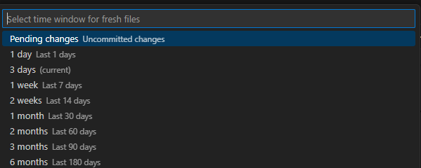
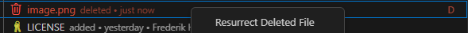
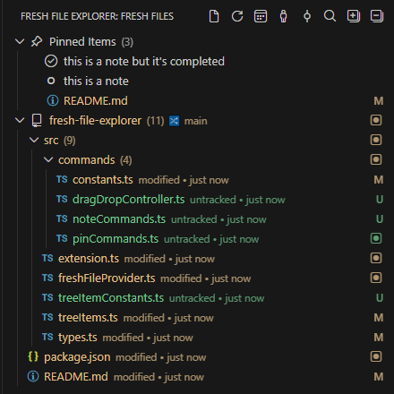
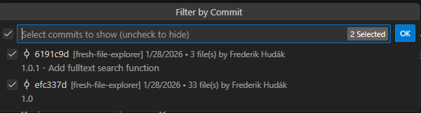
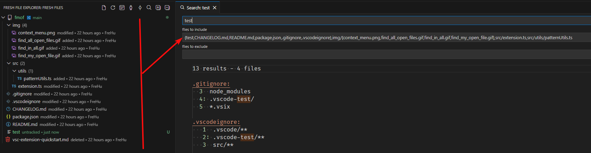
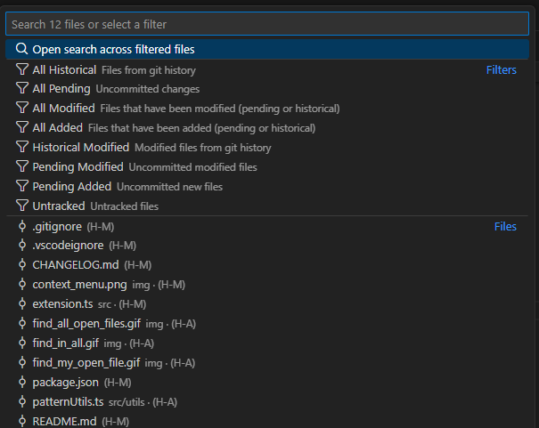
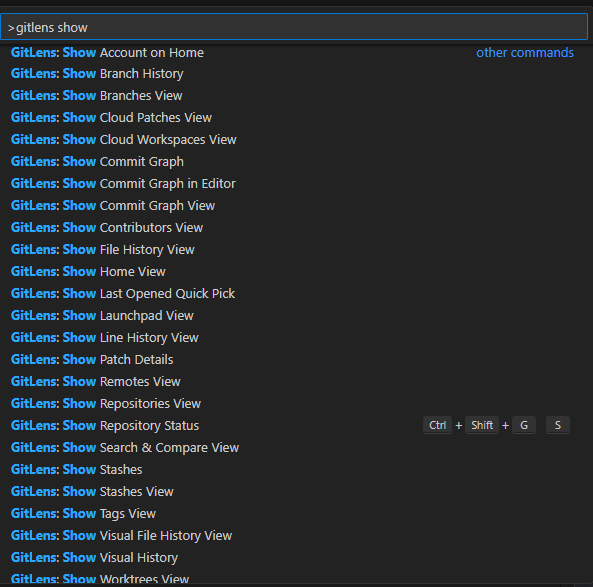

# Fresh File Explorer

A Visual Studio Code extension which provides a tree view showing only recently modified files based on recent Git history and your pending changes.

## Has this ever happened to you?

### "I just cloned a large repo and don't know where to start"

You joined a new company and the codebase has thousands of files. Most haven't been touched in the last 75 years. But the file explorer shows everything, making it overwhelming to find where active development is happening.

| Approach                | How it works                                                                      | Friction                                                     |
| ----------------------- | --------------------------------------------------------------------------------- | ------------------------------------------------------------ |
| **Default VS Code**     | Browse folders manually, maybe search for recent commits in Source Control        | High - requires mental context switching, no visual overview |
| **GitLens**             | Use "Commits" view to see recent commits, then navigate to files from there       | Medium - commit-centric view, extra clicks to open files     |
| [Fresh File Explorer](#features) | Open the Fresh Files panel, see all files modified in last 30 days as a file tree | Low - immediate visual overview, familiar tree navigation    |

---

### "I swear this file was here at some point"

You remember a file existed, but it's not there. Was it renamed? Moved? Did you misremember the path? Have you been drinking again? It's someone else's fault _this time_, but you're questioning your own sanity.

| Approach                | How it works                                                         | Friction                                        |
| ----------------------- | -------------------------------------------------------------------- | ----------------------------------------------- |
| **Default VS Code**     | Search for the filename, find nothing, assume you're wrong           | High - no hint that deletion occurred           |
| **GitLens**             | Would need to think "maybe it was deleted" and search commit history | High - requires the right mental model          |
| [Fresh File Explorer](#deleted-file-support) | Deleted files appear right where they used to be                     | Zero - it's still there, just marked as deleted |

---

### "I accidentally deleted some files and need them back"

**Pain Point:** You deleted files and realize you need them. They're committed to git but you wish it was easier to get them back.

| Approach                | How it works                                                     | Friction                                                  |
| ----------------------- | ---------------------------------------------------------------- | --------------------------------------------------------- |
| **Default VS Code**     | `git log --diff-filter=D`, then `git checkout <hash>^ -- <path>` | High - requires git expertise                             |
| **GitLens**             | Find the deletion commit, view file at revision, copy content    | Medium - several steps                                    |
| [Fresh File Explorer](#deleted-file-support) | Deleted files are there, right-click → "Resurrect"               | Low - one-click restore. Works on multiple files at once. |

---

### "I made a commit and now I've lost track of what I was working on"

You make a commit but now your "pending changes" view is empty. You've lost the mental map of which files you were touching. This actually discourages small, frequent commits because you want to keep that overview.

| Approach                | How it works                                                                                 | Friction                                                                                                        |
| ----------------------- | -------------------------------------------------------------------------------------------- | --------------------------------------------------------------------------------------------------------------- |
| **Default VS Code**     | Pending changes disappear after commit, must remember or check git log                       | High - punishes good commit practices                                                                           |
| **GitLens**             | Can view recent commits, but context switch required                                         | Medium - the information is there, but in a different place, and you can only have so many views open at a time |
| [Fresh File Explorer](#time-window-selection) | Set time window to "Last 7 days" - your committed files still appear, organized by directory | Low - commit freely, overview persists                                                                          |
### "I was using Fresh File Explorer and it was going great, but then someone reformatted the entire codebase and now all the files are fresh"

**Pain Point:** A large automated change (formatting, linting, dependency updates) pollutes your view of what actually changed.

| Approach                | How it works                                                                                           | Friction                                    |
| ----------------------- | ------------------------------------------------------------------------------------------------------ | ------------------------------------------- |
| **Default VS Code**     | No built-in way to filter by author                                                                    | High - must use terminal commands           |
| **GitLens**             | Can filter by author in various views                                                                  | Medium - need to know where to look         |
| [Fresh File Explorer](#filtering) | Filter out the person doing the formatting, or (it was _you_, wasn't it?) the commit where it was done | Low - visual multi-select, instant feedback |

---

### "Cool extension but I was looking for a todo list app"
**Pain Point:** There just aren't enough todo list apps out there.

| Approach  | How it works  | Friction  |
| --------------- | ----------------- | ---------------- |
| **Default VS Code**     | Is not a todo list | High - must vibe-code your own todo list |
| **GitLens**             | Is probably not a todo list | Medium - I don't know, maybe it even has a todo list  |
| [Fresh File Explorer](#pinned-section) | Is *also* a todo list | Low - Can't miss it |
---

## Features

### Time Window Selection

Switch between viewing pending (uncommitted) changes or files modified in configurable time periods.
Pending Changes mode shows uncommitted changes (esentially what the Source Control view would give you)

### Smart File Tree

Files are grouped by directory structure, with file counts on folders. Auto-expands to configurable depth.

### Deleted File Support
- Deleted files appear in the tree, clearly indicated
- **Exhume**: Open deleted file content in a read-only temp file (default action on clicking a deleted file)
- **Resurrect**: Restores the exhumed file to its original location

### Pinned section

At the top the tree, there is a special "pinned items" section. This is for files you want to keep handy independent of whatever the fresh file explorer is showing you. You can pin items with drag&drop or through the right click menu in the file explorer. 

- Pin a non-fresh file you need to pay attention to, like a diagram or readme
- Pin that critical file you've had on your desktop for the last 6 years. It does not have to be from your workspace.
- Pin a deleted file
- Create short notes and use it as a todo list. They can be reordered and marked as complete.
- Pin your sensitive API keys as notes. All the pros do it.

The pins are stored per workspace.

### Sync Status Notifications

Displays info at the top of the tree view:

- When you are behind/ahead of the remote (meaning you need to push/pull)
- When you are behind/ahead of the base branch (meaning you need to merge)

Both options can be individually disabled.

### Filtering
- **Filter by Author**: Hide files from specific authors
- **Filter by Commit**: Hide files from specific commits
- **Clear filters**
- Filters are temporary and reset when changing time windows
 

> **Note:** The extension tracks the _most recent_ commit per file only. If a file was modified by both a filtered author and a non-filtered author within the time window, the file will be hidden entirely (because the most recent commit is what's filtered). This is a deliberate simplification - for deeper history analysis, consider using something like GitLens or learning more than 5 git commands.

### Search

Click the search icon in the Fresh Files toolbar to open VS Code's search view with all currently visible files pre-filled in the "files to include" pattern. This lets you search only within the files you're actively working on, respecting your current filters and time window. This searches file *contents*. To search the tree, use `CTRL+ALT+F`. 

You can also trigger the search from the [quick pick](#quick-open-fresh-files).

**Features:**
- Respects author and commit filters
- Excludes deleted files or lines (they're not on disk to search)
- Configure whether the search opens in the view (*default*) or as an editor

**Limitations**

- The search simply prefills your include pattern in the search, but the pattern length is not infinite
- If you exceed the limit, vscode will simply refuse to search (`spawn ENAMETOOLONG` error will be shown in the search view). This means you need to lower the truncation limit in the settings.
- Automatically truncates the file list if the limit would be exceeded and warns you.
- You will probably be fine with <100 files, but ultimately this depends on how long the paths are in your workspace *(the true source of the error is that the maximum command line argument length is exceeded, which is how vscode performs the search)*. The length of the include pattern does not necessarily match the length of the command vscode will execute. I can't work around this limitation, but the maximum length is configurable.
- Brace expansion is used to optimize pattern length (e.g., `src/{a.ts,b.ts}` instead of `src/a.ts,src/b.ts`)
  

**Configuration:**
- `freshFileExplorer.openSearchInEditor`: Open searches in a Search Editor tab instead of the Search view
- `freshFileExplorer.searchPatternMaxLength`: Maximum pattern length before truncation (default: 4000 chars, tries to account for VS Code's expansion when calling ripgrep). Once more just to be clear: you are configuring the truncation limit, not the command line length limit (that depends on your OS). If you exceed the command line limit, you won't be able to search.

### Quick Open

Open the Command Palette and run **"Fresh Files: Quick Open"** to get a quick pick showing files from your Fresh File Explorer view. Type to filter by filename or path, then select a file to open it. This is similar to VS Code's Ctrl+P Quick Open, but filtered to only your fresh files, with some additional actions on top.

**Features:**
- Respects current time window, author and commit filters
- Special filter options to refine the list
- Special search option to trigger a fulltext search within these files
- You can use the filter first and then search to narrow down the list
  - First filter for example "pending modified"
  - A second quick pick will be shown with only those files
  - Now the search action will search only pending modified files

> Note: the quick open excludes deleted files. You'll have to access those from the tree.

### Context Menu Actions

- Open / Open to Side - you can toggle whether clicking a file opens the file or a diff
- Reveal in Explorer / Source Control
- Discard Changes (for pending files)
- Resurrect (for deleted files)

### Multi-Repository Support

Works with:

- Folders containing multiple repos in subfolders
- Multi-root workspaces
- Worktrees

**Submodules:**

- Submodules are shown in the tree but not their contents.
- You can also see deleted submodules, but can't exhume them.

I wanted to do more with submodules just for the fun of it but turns out it's not fun at all.

## Extension Settings

Look under `freshfileexplorer.` to see all configurable settings.

## Comparison with GitLens

Fresh File Explorer is **not** a GitLens replacement. It's a focused tool for one specific workflow: navigating recently changed files.

**Use Fresh File Explorer when**
- You want one view

**Use GitLens when**
- You want 25 views

Because one of those 25 is actually very similar to Fresh File Explorer, some more comparison can be found [here](./COMPARISON_WITH_GITLENS.md).

---

## Testimonials

> This is **above average** for a VS Code extension.
>
> _(a chatbot instructed to pretend to be Linus Torvalds)_