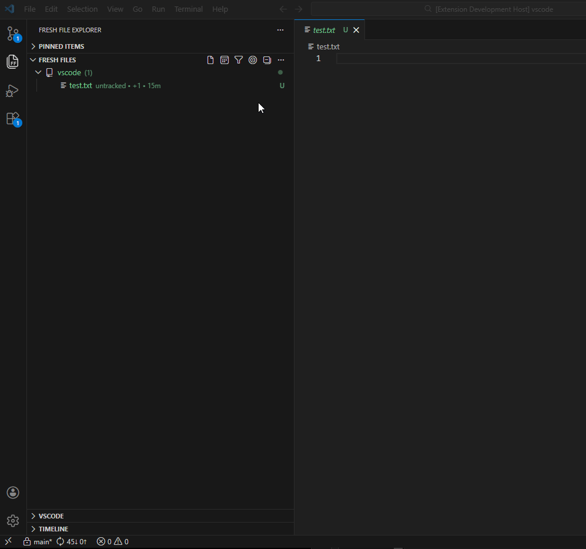
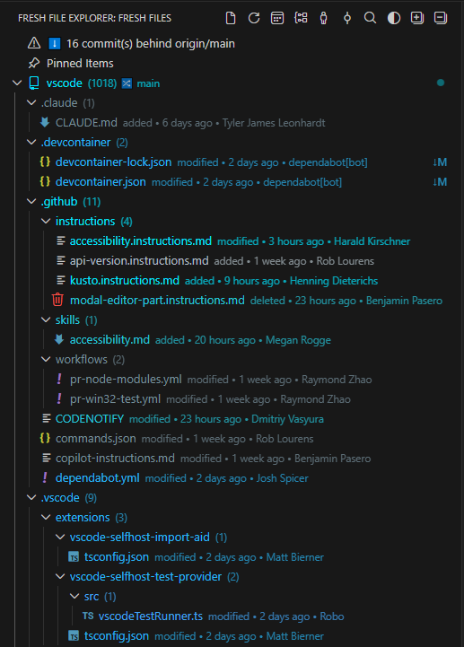
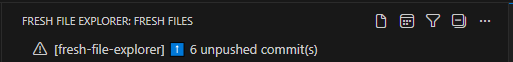
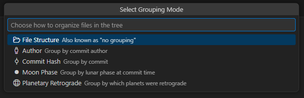
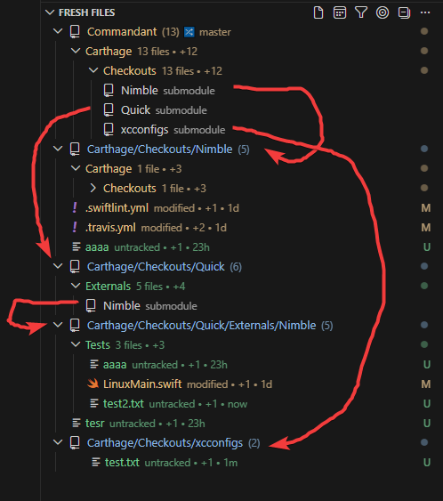
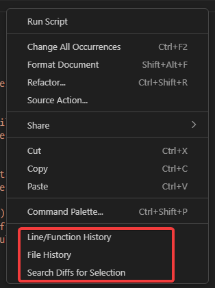
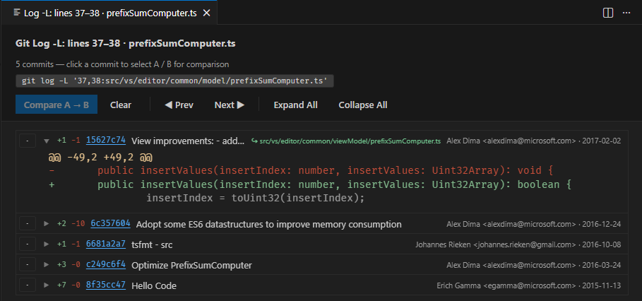
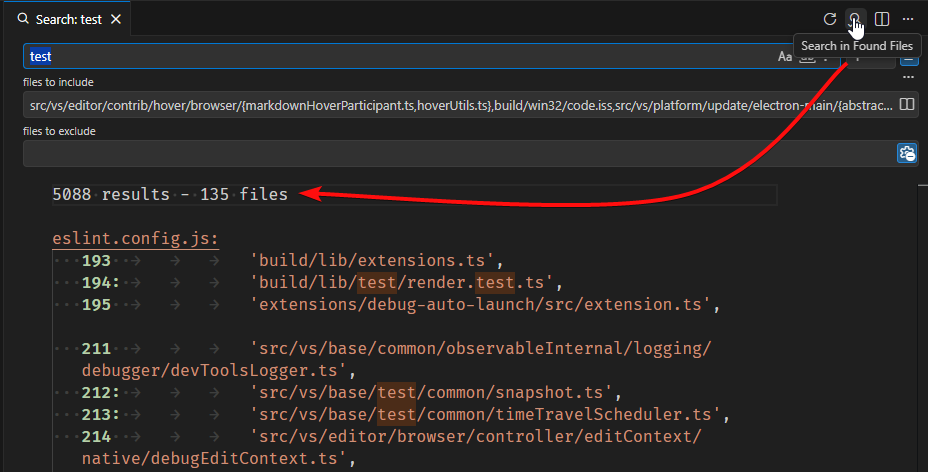
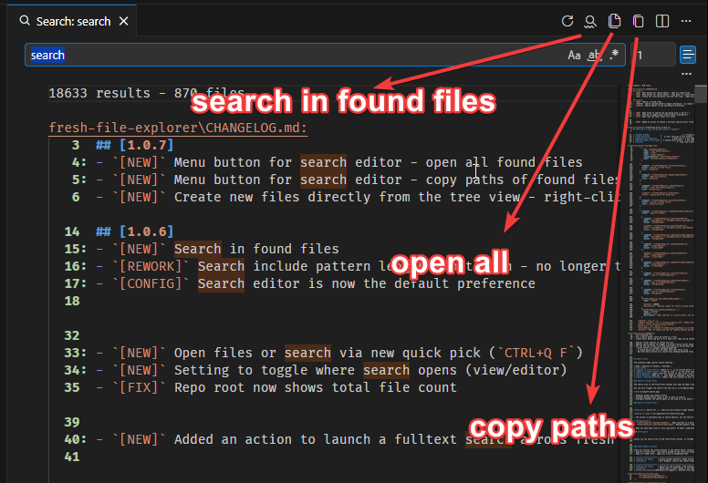
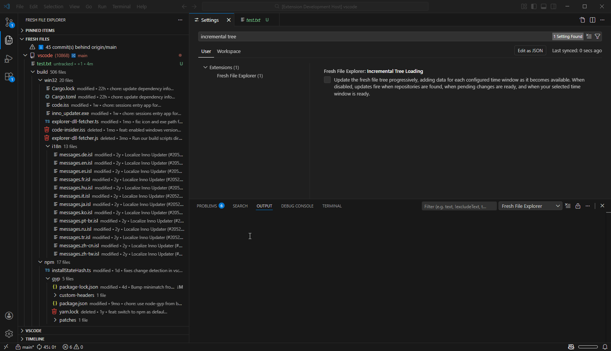

# Fresh File Explorer

Easily navigate recent changes based on your pending work and Git history.

# Links

[Marketplace](https://marketplace.visualstudio.com/items?itemName=frehu.fresh-file-explorer) | [OpenVSX](https://open-vsx.org/extension/frehu/fresh-file-explorer) | [Github](https://github.com/FreHu/vscode-fresh-file-explorer)
# Table of Contents

- [Features](#features)
  - [Fresh File Explorer](#fresh-file-explorer-1)
    - [Deleted File Support](#deleted-file-support)
    - [Heatmap Coloring](#heatmap-coloring)
    - [Pinned section](#pinned-section)
    - [Sync Status Notifications](#sync-status-notifications)
    - [Filtering](#filtering)
    - [Grouping Modes](#grouping-modes)
    - [Quick Open](#quick-open)
    - [Context Menu Actions](#context-menu-actions)
    - [Multi-Repository Support](#multi-repository-support)
  - [Search Tools](#search-tools)
    - [Diff Search](#diff-search)
    - [Line and Function History](#line-and-function-history)
    - [File History](#file-history)
    - [Search in Fresh Files](#search-in-fresh-files)
    - [Search in Found Files](#search-in-found-files)
    - [Search Editor Actions](#search-editor-actions)
- [Use Cases](#use-cases)
- [Extension Settings](#extension-settings)
- [Security](#security)
- [Contributing](#contributing)

# Features 
## Fresh File Explorer

Switch between viewing pending changes or files last modified in configurable time periods. 

The view is a hybrid of File explorer, which sometimes shows too much, and Source control, which sometimes shows too little.

  
### Deleted File Support

Deleted files appear in the tree where they used to be, ready for necromancy.

- **Exhume**: Click the file to open it in a read-only temp file
- **Resurrect**: Restores the file to its original location `(git restore)`
  

### Heatmap Coloring

Heatmap coloring gives files distinct colors based on the how recently they were last modified. Brighter colors `->` more recent.

This coloring is toggled in the Fresh Files view, but will also apply to the File Explorer.

> Note: the heatmap knows about modification dates based on your selected time window. Anything older than that gets bundled into the last "even older than that" color bucket.

### Pinned section

Adds a special "pinned items" view. This is for files you want to keep handy independent of whatever the fresh file explorer is showing you. You can pin items with drag&drop or through the right click menu in the file explorer. 

- Pin a non-fresh file you need to pay attention to, like a diagram or readme
- Pin that critical file you've had on your desktop for the last 6 years. It does not have to be from your workspace.
- Pin a deleted file
- Pin a search editor (must be saved as a file)
- Create short notes and use it as a todo list. They can be reordered and marked as complete.
- Pin your sensitive API keys as notes. All the pros do it.

The pins are stored per workspace.

### Sync Status Notifications

Displays info at the top of the tree view:

- When you are **behind/ahead** of the **remote** (meaning you need to push/pull)
- When you are **behind/ahead** of the **base branch** (meaning you need to merge)

Both options can be individually disabled.

### Filtering
- **Filter by Author**: Hide files from specific authors
- **Filter by Commit**: Hide files from specific commits
- **Pathspec Filter**: Restrict git log to specific files or directories using [git pathspecs](https://css-tricks.com/git-pathspecs-and-how-to-use-them/) (right-click on a repo folder)
- **Scope to Folder**: Focus on a specific folder within a repo (right-click on any folder)
- **Clear filters**
- Author and commit filters are temporary and reset when changing time windows
  

> **Note:** The extension tracks the _most recent_ commit per file only. If a file was modified by both a filtered author and a non-filtered author within the time window, the file will be hidden entirely (because the most recent commit is what's filtered). This is a deliberate simplification - for deeper history analysis, consider using something like GitLens or learning more than 5 git commands.

### Grouping Modes

Organize your files in different ways beyond the standard folder structure:

- **File Structure** - Traditional folder hierarchy
  
- **Flat list** - If you don't care for the nesting.
  
`freshFileExplorer.flatList.labelStyle` can customize whether the label is the full path or just the filename

- **Author** - Files grouped by who last modified them

- **Commit Hash** - One group per commit

As well as two additional groupings for advanced git blame use cases.

- **Moon Phase** (`git blame moon`)

Uneven distribution of commits during the full moon can indicate werevolves among your contributors.

- **Planetary Retrograde** (`git blame universe`)

Includes Pluto.

> Note: This is astronomy (hard science), not astrology (garbage). If you want to know if you will have merge conflicts with the changes made by a sagitarius, you need to look elsewhere.

**Relevant settings:**
`freshFileExplorer.defaultGroupingMode`
`freshFileExplorer.defaultSortOrder`

### Quick Open

Use **"Fresh Files: Quick Open"** to get a quick pick showing files from your Fresh File Explorer view. Type to filter by filename or path, then select a file to open it. This is similar to VS Code's Ctrl+P, but filtered to only your fresh files, with some additional actions on top.

**Features:**
- Respects current time window, author and commit filters
- Special filter options to refine the list
- Special search option to trigger a fulltext search within these files
- You can use the filter first and then search to narrow down the list
  - First filter for example "pending modified"
  - A second quick pick will be shown with only those files
  - Now the search action will search only pending modified files

> Note: the quick open excludes deleted files. You'll have to access those from the tree.

### Context Menu Actions

- Open / Open to Side - will open either the file or a diff depending on your preference. If the file is already open in some editor group, it will be focused instead.
- Reveal in Explorer / Source Control
- Discard Changes (for pending files)
- Resurrect (for deleted files)

### Multi-Repository Support

Works with:

- Folders containing multiple repos in subfolders
- Multi-root workspaces
- Worktrees
- Submodules (experimental, might have quirks)
  

---

## Search Tools

The extension adds several search features.

| Mode | Question it answers | Searches |
|---|---|---|
| **Search in Fresh Files** | Where is `x` in my current work? | File contents, on disk, scoped to fresh files |
| **Search in Found Files** | I want to find `y` in all files that contain `x`. | File contents, on disk, chained from a previous search |
| **File History** | What's the full history of this file? | Git log for an entire file, following renames |
| **Diff Search** | When was `x` ever added or removed? | Git diff history across all commits `(pickaxe)` |
| **Line / Function History** | What's the full history of this function or code block? | Git log for a specific line range or function name `(log -L)` |

### Diff Search (pickaxe)

Answers the question "when was this string ever added or removed?"

Access through the editor right-click menu ("Search Diffs for Selection").

Results appear in a tree view grouped by file and commit, and each match can be clicked to navigate to it.

### Line and Function History

Access via right-click in the editor → **"Line/Function History"**.

Based on your selection, shows every commit that touched those lines or that function, following renames. This is a wrapper of `git log -L`.

- **Single cursor / single line** — treated as a function name (uses the word under the cursor as the funcname pattern)
- **Multi-line selection** — treated as a line range

**A / B comparison:** Mark any two commits as A and B, then click **Compare** to open a diff between those two versions of the file.

### File History

Available via: 
- right-click menu in the Fresh File Explorer tree
- right-click in the editor context menu

### Search in Fresh Files

The search icon in the Fresh Files toolbar will open VS Code's search view with all currently visible files pre-filled in the "files to include" pattern. This lets you search only within the files you're actively working on, respecting your current filters and time window. This searches file *contents* on disk. To search the tree itself, use `CTRL+ALT+F`.

You can also trigger the search from the [quick pick](#quick-open).

- Respects author and commit filters
- Excludes deleted files (they're not on disk to search)
- Configure whether the search opens in the view or as an editor (*default*)

#### Code Telescope quick pick
- The quick pick `(CTRL+Q, F)` can be switched to open in the Code Telescope extension [(guichina.code-telescope)](https://marketplace.visualstudio.com/items?itemName=guichina.code-telescope). It provides a better search experience but remains fully optional (I don't make code telescope or install it for you).

You need to have the extension installed and enable `freshFileExplorer.codeTelescopeIntegration` for this to work.

### Search in Found Files

**Problem:** "I want to find `b` in all files that contain `a`."

**Solution:** Search for `a`, then use this action to open another search editor scoped to the files you found with your first search, then search for `b`. This process can be chained as many times as you want.

> The action is available only in search editors, not the search view. But you can easily open your search view as a search editor.

**Configuration:**
- `freshFileExplorer.openSearchInEditor`: Open searches in a Search Editor tab instead of the Search view
- `freshFileExplorer.searchPatternMaxLength`: Maximum pattern length per batch. Set a lower value if you encounter command-line length limits on your OS, or a higher value if your searches are getting batched. The default (4000 chars) is very conservative and can likely be set much higher on Linux.

> When you have many files or very long paths, VS Code's underlying search mechanism (ripgrep) can hit OS command-line length limits. In this case, the file list will be split into batches which will open as separate search editors.

### Search Editor Actions

There are several new action buttons in the search editor results:
- Search in found files - new search scoped to the files you found
- Open all found files - opens all files as background tabs
- Copy paths - copies all absolute or relative paths from the results

# Use Cases

## "I just cloned a large repo and don't know where to start"

You joined a new company and the codebase has thousands of files. Most haven't been touched in the last 75 years. But the file explorer shows everything, making it overwhelming to find where active development is happening.

| Approach                | How it works                                                                      | Friction                                                     |
| ----------------------- | --------------------------------------------------------------------------------- | ------------------------------------------------------------ |
| **Default VS Code**     | Browse folders manually, maybe search for recent commits in Source Control        | High - requires mental context switching, no visual overview |
| **GitLens**             | Use "Commits" view to see recent commits, then navigate to files from there       | Medium - commit-centric view, extra clicks to open files     |
| [Fresh File Explorer](#features) | Open the Fresh Files panel, see all files modified in last 30 days as a file tree | Low - immediate visual overview, familiar tree navigation    |

---

## "I swear this file was here at some point"

You remember a file existed, but it's not there. Was it renamed? Moved? Did you misremember the path? Have you been drinking again? It's someone else's fault _this time_, but you're questioning your own sanity.

| Approach                | How it works                                                         | Friction                                        |
| ----------------------- | -------------------------------------------------------------------- | ----------------------------------------------- |
| **Default VS Code**     | Search for the filename, find nothing, assume you're wrong           | High - no hint that deletion occurred           |
| **GitLens**             | Would need to think "maybe it was deleted" and search commit history | High - requires the right mental model          |
| [Fresh File Explorer](#deleted-file-support) | Deleted files appear right where they used to be                     | Zero - it's still there, just marked as deleted |

---

## "I accidentally deleted some files and need them back"

**Pain Point:** You deleted files and realize you need them. They're committed to git but you wish it was easier to get them back.

| Approach                | How it works                                                     | Friction                                                  |
| ----------------------- | ---------------------------------------------------------------- | --------------------------------------------------------- |
| **Default VS Code**     | `git log --diff-filter=D`, then `git checkout <hash>^ -- <path>` | High - requires git expertise                             |
| **GitLens**             | Find the deletion commit, view file at revision, copy content    | Medium - several steps                                    |
| [Fresh File Explorer](#deleted-file-support) | Deleted files are there, right-click → "Resurrect"               | Low - one-click restore. Works on multiple files at once. |

---

## "I made a commit and now I've lost track of what I was working on"

You make a commit but now your "pending changes" view is empty. You've lost the mental map of which files you were touching. This actually discourages small, frequent commits because you want to keep that overview.

| Approach                | How it works                                                                                 | Friction                                                                                                        |
| ----------------------- | -------------------------------------------------------------------------------------------- | --------------------------------------------------------------------------------------------------------------- |
| **Default VS Code**     | Pending changes disappear after commit, must remember or check git log                       | High - punishes good commit practices                                                                           |
| **GitLens**             | Can view recent commits, but context switch required                                         | Medium - the information is there, but in a different place, and you can only have so many views open at a time |
| [Fresh File Explorer](#time-window-selection) | Set time window to "Last 7 days" - your committed files still appear, organized by directory | Low - commit freely, overview persists                                                                          |

## "I was using Fresh File Explorer and it was going great, but then someone reformatted the entire codebase and now all the files are fresh"

**Pain Point:** A large automated change (formatting, linting, dependency updates) pollutes your view of what actually changed.

| Approach                | How it works                                                                                           | Friction                                    |
| ----------------------- | ------------------------------------------------------------------------------------------------------ | ------------------------------------------- |
| **Default VS Code**     | No built-in way to filter by author                                                                    | High - must use terminal commands           |
| **GitLens**             | Can filter by author in various views                                                                  | Medium - need to know where to look         |
| [Fresh File Explorer](#filtering) | Filter out the person doing the formatting, or (it was _you_, wasn't it?) the commit where it was done | Low - visual multi-select, instant feedback |

---

## "Cool extension but I was looking for a todo list app"

**Pain Point:** There just aren't enough todo list apps out there.

| Approach  | How it works  | Friction  |
| --------------- | ----------------- | ---------------- |
| **Default VS Code**     | Is not a todo list | High - must vibe-code your own todo list |
| **GitLens**             | Is probably not a todo list | Medium - I don't know, maybe it even has a todo list  |
| [Fresh File Explorer](#pinned-section) | Is *also* a todo list | Low - Can't miss it |
---

## "Cool extension but can it group my files by moon phase"

[Yes.](#grouping-modes) It might even be the *only* piece of software that does that.

# Extension Settings

Look under `freshfileexplorer.` to see all configurable settings.

# Performance

Unlike File explorer, which just needs the files on your disk, Fresh File explorer must load a part of your git history to work. This is done in one streaming pass on startup, after which the results are cached. The startup time is very close to `O(wait for git)`. Reloads need to happen when switching branches or syncing changes.

Not looking 5 years back in a large repo will go a long way in terms of performance. But you can.

# Security

I got some feedback around what is essentially an inherent problem with the trustworthiness of extensions in general. It's a valid concern and not one I can solve. 

All I can give you is some assurrances:

- Fresh File Explorer contains no telemetry and does not make any web requests. It doesn't ask AI to do anything.
- The code is right here for you to audit. There are zero runtime dependencies.
- If you're worried about me getting hacked and malware being pushed through an update, you can disable automatic updates for any extension. You will lose out on new bugs and features, but you will always have the code you at some point chose to trust.
- The marketplace PATs are not stored on my machine. Github actions handle publishing to both marketplaces (vscode and openVSX). I don't publish to any other marketplace.

Potentially dangerous features: none, really. But for completeness' sake:
- The only destructive operation the extension can do is [discard pending changes](./src/commands/discardChangesCommand.ts). It works on files you yourself selected and gives you a warning. 
- It can create files if you choose to (via create or resurrect), but will never overwrite existing ones.
- When viewing deleted files (referred to as `exhume`), a copy is saved as a temp file in `%TEMP%\fresh-file-explorer` or `/tmp/fresh-file-explorer`. This is only for files you try to open. If you really want something gone, you'll have to delete it from there.
- Commands that involve user-controlled data (like filenames from git output) use `cp.spawn("git", args)` to prevent shell injection.
  
As well as some warnings:

- Don't install random extensions from the internet just because they look cool. They can do pretty much whatever on your computer. Except for mine, mine's good.
- A person who doesn't already know this is unlikely to bother reading this documentation.

# Contributing

If you find a bug or have an idea for a faster horse, open an issue.

For bug reports, it is extremely helpful if the problem is reproducible on a public repository.

# Comparison with GitLens

Fresh File Explorer is **not** a GitLens replacement. It's a more focused, opinionated tool oriented around finding things you need right now. It doesn't make commits, manage branches, stashes, tags...

**Use Fresh File Explorer when**
- You want one view

**Use GitLens when**
- You want 25 views

Because one of those 25 is actually very similar to Fresh File Explorer, some more comparison can be found [here](./COMPARISON_WITH_GITLENS.md).

# Testimonials

> This is **above average** for a VS Code extension.
>
> _(a chatbot instructed to pretend to be Linus Torvalds)_e GitLens when**
- You want 25 views

Because one of those 25 is actually very similar to Fresh File Explorer, some more comparison can be found [here](./COMPARISON_WITH_GITLENS.md).

# Testimonials

> This is **above average** for a VS Code extension.
>
> _(a chatbot instructed to pretend to be Linus Torvalds)_